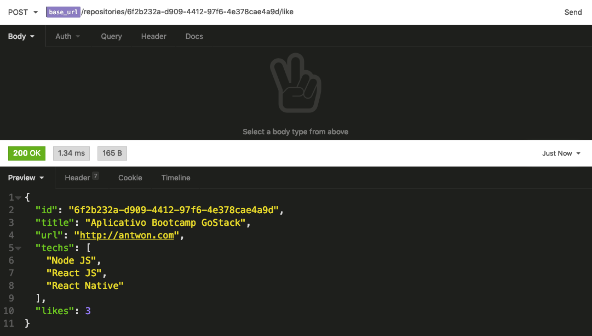

<h1 align="center">
    
</h1>

<h3 align="center">
  Desafio sobre Conceitos de Node JS aplicado no Bootcamp GoStack
</h3>

<p align="center">
  <a href="#rocket-sobre-a-aplicação">Sobre a Aplicação</a>&nbsp;&nbsp;&nbsp;|&nbsp;&nbsp;&nbsp;
  <a href="#conteúdo-abordado">Conteúdo Abordado</a>&nbsp;&nbsp;&nbsp;|&nbsp;&nbsp;&nbsp;
  <a href="#instalação">Instalação</a>&nbsp;&nbsp;&nbsp;|&nbsp;&nbsp;&nbsp;
  <a href="#executando-a-aplicação">Executando a Aplicação</a>&nbsp;&nbsp;&nbsp;|&nbsp;&nbsp;&nbsp;
  <a href="#executando-os-testes-da-aplicação">Executando os Testes da Aplicação</a>&nbsp;&nbsp;&nbsp;|&nbsp;&nbsp;&nbsp;
  <a href="#rotas-da-aplicação">Rotas da aplicação</a>&nbsp;&nbsp;&nbsp;|&nbsp;&nbsp;&nbsp;
  <a href="#exemplos-de-uso-no-insomnia">Exemplos de Uso no Insomnia</a>&nbsp;&nbsp;&nbsp;|&nbsp;&nbsp;&nbsp;
  <a href="#memo-licença">Licença</a>
</p>

## :rocket: Sobre a Aplicação

Essa é uma aplicação para armazenar repositórios do seu portfólio, que irá permitir a criação, listagem, atualização e remoção dos repositórios, e além disso permitir que os repositórios possam receber "likes".

## Conteúdo Abordado

- Conceitos NodeJS;
- Conceitos API REST;
- Criando projeto Node;
- Configurando Nodemon;
- Métodos HTTP;
- Utilizando o Insomnia;
- Tipos de Parâmetros;
- Aplicação Funcional;
- Middlewares.

## Instalação

Instalação das dependências do projeto.

```sh
# Com NPM
npm install

# Com Yarn
yarn
```

## Executando a Aplicação

```sh
# Com NPM
npm run dev

# Com Yarn
yarn dev
```

## Executando os Testes da Aplicação

```sh
# Com NPM
npm run test

# Com Yarn
yarn test
```

## Rotas da aplicação

- `POST /repositories`: A rota deve receber `title`, `url` e `techs` dentro do corpo da requisição, sendo a URL o link para o github desse repositório. Ao cadastrar um novo projeto, ele deve ser armazenado dentro de um objeto no seguinte formato: `{ id: "uuid", title: 'Desafio Node.js', url: 'http://github.com/...', techs: ["Node.js", "..."], likes: 0 }`;

- `GET /repositories`: Rota que lista todos os repositórios;

- `PUT /repositories/:id`: A rota deve alterar apenas o title, a url e as techs do repositório que possua o id igual ao id presente nos parâmetros da rota;

- `DELETE /repositories/:id`: A rota deve deletar o repositório com o id presente nos parâmetros da rota;

- `POST /repositories/:id/like`: A rota deve aumentar o número de likes do repositório específico escolhido através do id presente nos parâmetros da rota, a cada chamada dessa rota, o número de likes deve ser aumentado em 1;

## Exemplos de Uso no Insomnia

### Criando um Repositórios


### Listando Repositórios


### Editando um Repositório


### Aplicando um Like em um Repositório



## :memo: Licença

Esse projeto está sob a licença MIT. Veja o arquivo [LICENSE](LICENSE.md) para mais detalhes.
